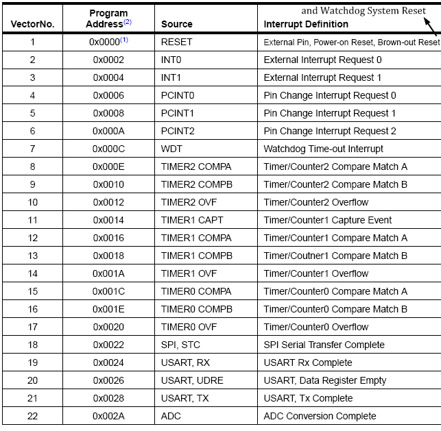
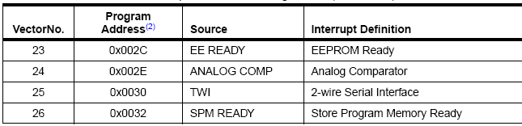
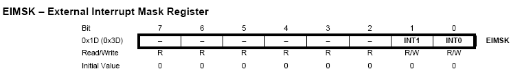

## 從 Arduino 到 AVR 晶片(2) -- Interrupts 中斷處理 (作者：Cooper Maa)

### 什麼是 Interrupts?

當你在工作的時候，突然電話鈴聲響起，於是你把手邊工作停下來、接電話、講電話，然後回來繼續剛剛工作 －－ 這就是所謂的中斷 (Interrupt)，而電話便是中斷源。

在微控制器中，中斷的來源有很多，諸如 Reset, 外部中斷, Timer, USART, EEPROM, ADC 等。比如，當 Timer Overflow 時可以引發中斷，當 USART 收到資料或資料傳輸完畢時可以引發中斷…

跟人一樣，在遇到中斷的時候，微控制器的 CPU 也會把手邊的工作停下來，然後跳到預設的位址 (接電話)，接著執行一段程式 (講電話)，執行完後回來繼續進行剛剛的工作。

在發生中斷的時候，CPU 會老老實實的做這幾個動作：

1. 執行當前的指令
2. 把下一個指令的位址 push 到 stack 上，停止程式的正常流程，然後
3. 跳到預設的位址，這個位址稱為中斷向量表，是由 MCU 製造商預先定義好的。 在中斷向量表中，每個中斷都有一個 entry，就看發生什麼中斷，CPU 就跳到哪個 entry。通常每個 entry 裏只是一條 JMP xxxx 的指令，會讓 CPU 輾轉跳到一段稱為中斷服務函式 (Interrupt Service Routine, ISR) 的副程式。
4. 接著執行中斷服務函式
5. 當執行完中斷服務函式後，再從 stack 上 pop 出指令的位址，並從它離開的地方繼續執行程式

電腦比人強的地方，在於它的記憶力好，沒健忘症，當 CPU 處理完中斷後，一定會回去進行原來的工作，除非程式開發者疏忽了把 ISR 寫成跳不出來的無窮迴圈。

### Interrupt vectors

底下這張是 ATmega328 的中斷向量表：





當中斷觸發時，CPU 會跳到預設的位址，例如當 ADC 轉換完成時會引發 ADC 中斷，CPU 這時就會跳到 0x002A 這個位址 (vector 22 所在的位址) 去執行指令。如前面說的，通常中斷向量表的每個 entry 裏只是一條 JMP xxxx 的指令，會讓 CPU 輾轉跳到中斷服務函式 (ISR)。

底下是中斷向量表典型的設定:

```
Address Labels Code             Comments
0x0000         jmp RESET        ; Reset Handler
0x0002         jmp EXT_INT0     ; IRQ0 Handler
0x0004         jmp EXT_INT1     ; IRQ1 Handler
0x0006         jmp PCINT0       ; PCINT0 Handler
0x0008         jmp PCINT1       ; PCINT1 Handler
0x000A         jmp PCINT2       ; PCINT2 Handler
0x000C         jmp WDT          ; Watchdog Timer Handler
0x000E         jmp TIM2_COMPA   ; Timer2 Compare A Handler
0x0010         jmp TIM2_COMPB   ; Timer2 Compare B Handler
0x0012         jmp TIM2_OVF     ; Timer2 Overflow Handler
0x0014         jmp TIM1_CAPT    ; Timer1 Capture Handler
0x0016         jmp TIM1_COMPA   ; Timer1 Compare A Handler
0x0018         jmp TIM1_COMPB   ; Timer1 Compare B Handler
0x001A         jmp TIM1_OVF     ; Timer1 Overflow Handler
0x001C         jmp TIM0_COMPA   ; Timer0 Compare A Handler
0x001E         jmp TIM0_COMPB   ; Timer0 Compare B Handler
0x0020         jmp TIM0_OVF     ; Timer0 Overflow Handler
0x0022         jmp SPI_STC      ; SPI Transfer Complete Handler
0x0024         jmp USART_RXC    ; USART, RX Complete Handler
0x0026         jmp USART_UDRE   ; USART, UDR Empty Handler
0x0028         jmp USART_TXC    ; USART, TX Complete Handler
0x002A         jmp ADC          ; ADC Conversion Complete Handler
0x002C         jmp EE_RDY       ; EEPROM Ready Handler
0x002E         jmp ANA_COMP     ; Analog Comparator Handler
0x0030         jmp TWI          ; 2-wire Serial Interface Handler
0x0032         jmp SPM_RDY      ; Store Program Memory Ready Handler
;
0x0033RESET:   ldi r16, high(RAMEND); Main program start
0x0034         out SPH,r16 ; Set Stack Pointer to top of RAM
0x0035         ldi r16, low(RAMEND)
0x0036         out SPL,r16
0x0037         sei ; Enable interrupts
0x0038         <instr> xxx
```

以上面的程式為例，當發生 reset 中斷時，MCU 執行的第一條指令是 jmp RESET，因此會跳到 0x0033 的位址，亦即主程式的起始位置。假如是 ADC 中斷，MCU 會先跳到中斷向量表 0x002A 的位址，之後輾轉跳到 ADC 這個中斷服務函式。

### Interrupt Service Routine (ISR)

在 Arduino 的程式中，要寫 ISR 是很簡單的一件事。你不需要自己設定中斷向量表，只要會使用 ISR() 這個巨集指令就可以了，例如: 

```
ISR(ADC_vect)
{

// Your code here

}
```

這表示這個是處理 ADC 轉換的中斷服務函式，將來當 ADC 轉換完成時會引發中斷，CPU 就會來執行這個中斷服務函式。

底下這張表列出了 ATmega328 的所有中斷向量，可在 <avr/iom328p.h> 中找到

Vector                  說明
------------            -----------------------------------
INT0_vect               External Interrupt Request 0
INT1_vect               External Interrupt Request 1
PCINT0_vect             Pin Change Interrupt Request 0
PCINT1_vect             Pin Change Interrupt Request 1
PCINT2_vect             Pin Change Interrupt Request 2
WDT_vect                Watchdog Time-out Interrupt
TIMER2_COMPA_vect       Timer/Counter2 Compare Match A
TIMER2_COMPB_vect       Timer/Counter2 Compare Match B
TIMER2_OVF_vect         Timer/Counter2 Overflow
TIMER1_CAPT_vect        Timer/Counter1 Capture Event
TIMER1_COMPA_vect       Timer/Counter1 Compare Match A
TIMER1_COMPB_vect       Timer/Counter1 Compare Match B
TIMER1_OVF_vect         Timer/Counter1 Overflow
TIMER0_COMPA_vect       TimerCounter0 Compare Match A
TIMER0_COMPB_vect       TimerCounter0 Compare Match B
TIMER0_OVF_vect         Timer/Couner0 Overflow
SPI_STC_vect            SPI Serial Transfer Complete
USART_RX_vect           USART Rx Complete
USART_UDRE_vect         USART, Data Register Empty
USART_TX_vect           USART Tx Complete
ADC_vect                ADC Conversion Complete
EE_READY_vect           EEPROM Ready
ANALOG_COMP_vect        Analog Comparator
TWI_vect                Two-wire Serial Interface
SPM_READY_vect          Store Program Memory Read

### 外部中斷實驗 (External Interrupts)

#### 實驗目的

練習處理外部中斷。在這個實驗中，你將利用 ISR() 巨集指令設定中斷服務函式 (Interrupt Service Routine, ISR)，讓程式在 pin 2 產生外部中斷時自動執行 ISR。

#### 材料

* Arduino 主板 x 1
* LED x 1
* Pushbutton x 1
* 10K 歐姆電阻 x 1
* 麵包板 x 1
* 單心線 x N

#### 接線

把 LED 接到 pin13，長腳 (陽極) 接到 pin13，短腳 (陰極) 接到 GND
把 pushbutton 一支腳接到 +5V，另一支腳接到 pin 2 同時接一顆 10K 電阻連到 GND


#### INT0 與 INT1 外部中斷

如下圖所示，ATmega328 有兩個外部中斷，編號 0 (INT0) 在 pin 2 上，而編號 1 (INT1) 在 pin 3 上:


我們可以決定什麼時候要觸發 INT0 和 INT1 外部中斷，一共有四種狀況可以選擇:

* LOW: 當 pin 為 LOW 時觸發中斷
* CHANGE: 當 pin 狀態改變時觸發中斷，不管是從 HIGH 到 LOW 或從 LOW 到 HIGH
* FALLING: 當 pin 狀態從 HIGH 到 LOW 時觸發中斷，又稱負緣觸發
* RISING: 當 pin 狀態從 LOW 到 HIGH 時觸發中斷，又稱正緣觸發

選擇的方法是透過 ECIRA (External Interrupt Control Register A) 這個暫存器:


以 INT0 外部中斷為例，假如我們希望 pin 2 狀態一有改變就觸發中斷，那麼就要把 ISC01 和 ISC00 設成 01:

```CPP
EICRA &= ~_BV(ISC01);                  // pin 狀態改變時觸發中斷
EICRA |= _BV(ISC00);                   
```

除此以外，我們還要設定 EIMSK (External Interrupt Mask Register) 暫存器以啟用 INT0 或 INT1 中斷:



以 INT0 外部中斷為例，要啟用 INT0 外部中斷，得把 INT0 這個位元設成 1:

```CPP
EIMSK |= _BV(INT0);                    // enable INT0
```

#### 程式

先來看使用 [attachInterrupt()](https://docs.google.com/uc?id=0B4GOwiN2Qm96NmEyOGE4NWItNmEwOS00Mjg5LTljMGQtYjM5NzcyNjE1Mzc0&export=download&hl=en) 函式的版本(attachInterrupt.pde)，這我們在「 [attachInterrupt() 與外部中斷](http://feedproxy.google.com/~r/CooperMaa/~3/HGxWXannOiM/attachinterrupt.html) 」一文中介紹過，程式的邏輯是，當按鍵被按下時打開 LED 燈號，在按鍵放開時關閉 LED 燈號:

```CPP

/*
 * attachInterrupt.pde: attachInterrupt() 與外部中斷
 */

const int interruptNumber = 0;           // Interrupt 0 在 pin 2 上
const int buttonPin = 2;                 // 按鈕(pushbutton)
const int ledPin = 13;                   // LED
volatile int buttonState;                // 用來儲存按鈕狀態

void setup() {
  pinMode(ledPin, OUTPUT);               // 把 ledPin 設置成 OUTPUT
  pinMode(buttonPin, INPUT);             // 把 buttonPin 設置成 INPUT
  
  // 把外部中斷(interrupt 0)連接到 buttonStateChanged() 函式
  // CHANGE 是指當 pin 狀態改變時就觸發中斷&#65292;不管是從 HIGH 到 LOW 或從 LOW 到 HIGH
  attachInterrupt(interruptNumber, buttonStateChanged, CHANGE);
}

void loop() {
  // do nothing
}

// Interrupt 0 的中斷處理函式
// 讀取 buttonPin 的狀態&#65292;並反應到 ledPin 上
void buttonStateChanged() {
  buttonState = digitalRead(buttonPin);
  digitalWrite(ledPin, buttonState);
}
```

要特別注意是，程式裏的 buttonState 變數是宣告成 volatile，這樣做的目的是告訴 Compiler 不要做最佳化，避免變數狀態不同步。給你一個建議，程式主體跟 ISR 都會用到的變數，盡可能把它宣告成 volatile。

接下來是改成用 EICRA 和 EIMSK 暫存器和 ISR() 巨集指令的版本:

```CPP
/*
 * externalInterrupt.pde: INT 0 外部中斷
 */

const int interruptNumber = 0;           // Interrupt 0 在 pin 2 上
const int buttonPin = 2;                 // 按鈕(pushbutton)
const int ledPin = 13;                   // LED
volatile int buttonState;                // 用來儲存按鈕狀態

void setup() {
  pinMode(ledPin, OUTPUT);               // 把 ledPin 設置成 OUTPUT
  pinMode(buttonPin, INPUT);             // 把 buttonPin 設置成 INPUT
  
  EIMSK |= _BV(INT0);                    // enable INT 0
  EICRA &= ~_BV(ISC01);                  // pin 狀態改變時觸發中斷
  EICRA |= _BV(ISC00);                   
}

void loop() {
  // do nothing
}

// 讀取 buttonPin 的狀態&#65292;並反應到 ledPin 上
void buttonStateChanged() {
  buttonState = digitalRead(buttonPin);
  digitalWrite(ledPin, buttonState);
}

// Interrupt 0 的中斷處理函式
ISR(INT0_vect) {
  buttonStateChanged();
}
```

簡單的說，要處理 INT0 外部中斷，有三個步驟要做:

1. 用 ISR() 巨集指令定義中斷服務函式
2. 設定 EIMSK 暫存器啟用 INT0 中斷
3. 設定 EICRA 暫存器決定什麼時候該觸發中斷

_BV() 巨集我們在「2.2) Blink part2」一文中已經介紹過，如果不想使用 _BV()，這樣寫也是可以的:

```CPP
EIMSK |= (1 << INT0);                  // enable INT 0
EICRA |= (1 << ISC00);                 // pin 狀態改變時觸發中斷
EICRA &= ~(1 << ISC01);
```

另外，ISR() 巨集指令也可以改用 SIGNAL() 巨集指令，SIGNAL() 是早期寫 ISR 的巨集指令。建議你盡可能使用 ISR() 巨集指令，因為 ISR() 比較直覺，只不過你必須知道 SIGNAL() 和 ISR() 幾乎是一樣的東西，而且很多前輩留下的 AVR 程式是用 SIGNAL() 巨集指令。

#### 延伸閱讀

* [attachInterrupt() 與外部中斷](http://feedproxy.google.com/~r/CooperMaa/~3/HGxWXannOiM/attachinterrupt.html)

【本文作者為馬萬圳，原文網址為： <http://coopermaa2nd.blogspot.tw/2011/04/3-interrupts.html> ,  <http://coopermaa2nd.blogspot.tw/2011/07/31-external-interrupts.html> ，由陳鍾誠編輯後納入本雜誌】

