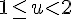
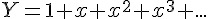
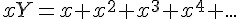
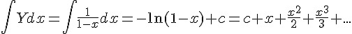
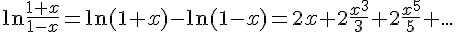
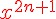
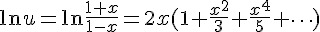

## 對數 (logarithm) (作者：Bridan)

以前曾經寫文說明 [開根號](http://4rdp.blogspot.tw/2008/04/blog-post_9406.html) 的數學計算，今天就說明工程計算機另一重要計算功能 ─  [對數](http://en.wikipedia.org/wiki/Logarithm) 。

對數的發明，是因為數學家想簡化算數乘除計算的繁瑣，對數的方法於1614年被約翰·納皮爾 (John Napier) 在 Mirifici Logarithmorum Canonis Descriptio  (Description of the Wonderful Rule of Logarithms) 書中首次公開，而對數符號 log 來自拉丁文 logarithm，是由義大利數學家卡瓦列里 (Cavalieri，1598 - 1647) 所提出。

對數的觀念簡單的說，把數值乘除轉換成數值加減，在計算機發明前需要查表換算，加減計算後再反查表求出最後答案，因此有人發明 [計算尺](http://4rdp.blogspot.tw/2011/08/slide-rule.html) ，解決查表換算問題。

```
log(X*Y) = log(X) + log(Y)
log(X/Y) = log(X) - log(Y)
log(Xa) = a * log(X)
```

另外，為了區別以 10 為基底及 [超越數 e (Euler's number)] 為基底的對數，數學習慣分別表示為 log(X)和 ln(X)，而計算機語言喜歡用 log10(X)及 log(X)表示。在日常應用方面，由於人類對外界感覺的魯鈍，也運用了許多對數的觀念，例如，聲音用分貝、地震用芮氏規模、天文觀測用星等，意思是訊號要變化很大，人們才會有所感覺。

回歸主題，本文的要點為計算機如何計算對數值？在 [資料型態認識─浮點數 (single ＆ double)](http://4rdp.blogspot.tw/2010/03/signle-double.html)  一文提到，任何正實數可以表示為    ， 是整數，    ，那 

   　

接下來就要思考如何計算 ln(u)，這需要
從等比級數和說起，令 Y 為等比級數和，將它減掉與 x 相乘的值等於 1，因此 Y 可得一個生成函數 1/(1-x)。

   　

   　

   　

   　


如果要讓等比級數和 Y 收斂等於生成函數，其要件為 |x|＜1。然後將 Y 對 x 積分可得，

   　
   　

將上式 x 改以 -x 代入

    　

然後兩式合併

    　

可能有人看到這裡，覺得越搞越複雜，其實這是計算機快速收斂最好的方法，因為計算 ln(1+x)將需要計算更多項次才能達到更好的精確度， **如果要精確到小數第 n 位，必須算到**    。那如何求出 x，令

    　

    　

以上是超越數 e 為基底的對數計算，若想計算以 10 為基底的對數可以利用下列公式換算

   　

(本文來自「研發養成所」 Bridan 的網誌，原文網址為 <http://4rdp.blogspot.tw/2014/06/logarithm.html> ，由陳鍾誠編輯後納入程式人雜誌)

[超越數 e (Euler's number)]:http://zh.wikipedia.org/wiki/E_(%E6%95%B0%E5%AD%A6%E5%B8%B8%E6%95%B0)
